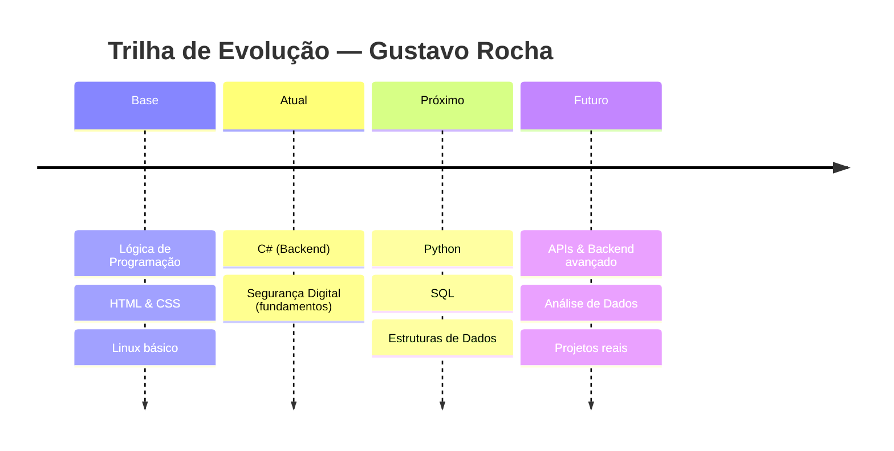

<div align="center">

<!-- ===================== HEADER ===================== -->


<!-- Fonte grande, estilo cyber -->


<!-- Fonte menor, estilo terminal -->


</div>


<!-- ===================== GALERIA GIF ===================== -->
<div align="center">


</div>


##  `01 // whoami`

<div align="center">

```ansi
┌──────────────────────────────────────────────┐
│  gustavo@ghostshell:~$ neofetch                │
├──────────────────────────────────────────────┤
│  Nome ......... Gustavo Rocha                 │
│  Idade ........ 16 anos                       │
│  Localização .. Brasil                        │
│  OS ........... Linux (em estudo)             │
│  Foco ......... Backend & Análise de Dados    │
│  Linguagem .... C# (aprendendo)                │
│  Uptime ....... desde sempre curioso :)       │
│  Shell ........ bash                           │
└──────────────────────────────────────────────┘
```

</div>

<div align="center">

</div>


##  `02 // stack_neural`

<div align="center">


<br><br>


<br><br>


</div>

<br>

<div align="center">


</div>


##  `03 // log_de_missao`

<div align="center">

</div>

```diff
+ [ONLINE]     Lógica de programação
+ [ONLINE]     HTML / CSS
+ [ONLINE]     Fundamentos de Linux
+ [ONLINE]     Noções de segurança digital
~ [CARREGANDO] C# — aprofundando back-end .......... [██████████░░░░░░░░░░] 50%
! [EM FILA]    Análise de Dados (Python / SQL) ...... [███░░░░░░░░░░░░░░░░░] 15%
! [EM FILA]    Estruturas de dados & algoritmos ..... [██░░░░░░░░░░░░░░░░░░] 10%
```

###  Roadmap




##  `04 // painel_de_status`

<div align="center">

<!-- SUBSTITUA "seu-usuario" pelo seu usuário do GitHub em TODOS os links abaixo -->


</div>

<div align="center">


</div>

<!-- Cobra comendo o gráfico de contribuições (precisa de 1 GitHub Action pra gerar, ver instruções abaixo) -->
<div align="center">

</div>


##  `05 // canais_de_comunicacao`

<div align="center">

<!-- Substitua os links pelos seus reais -->
<a href="#"></a>
<a href="#"></a>
<a href="#"></a>
<a href="mailto:seuemail@exemplo.com"></a>

<br><br>

<!-- Contador de visitantes -->


</div>


<div align="center">


</div>
